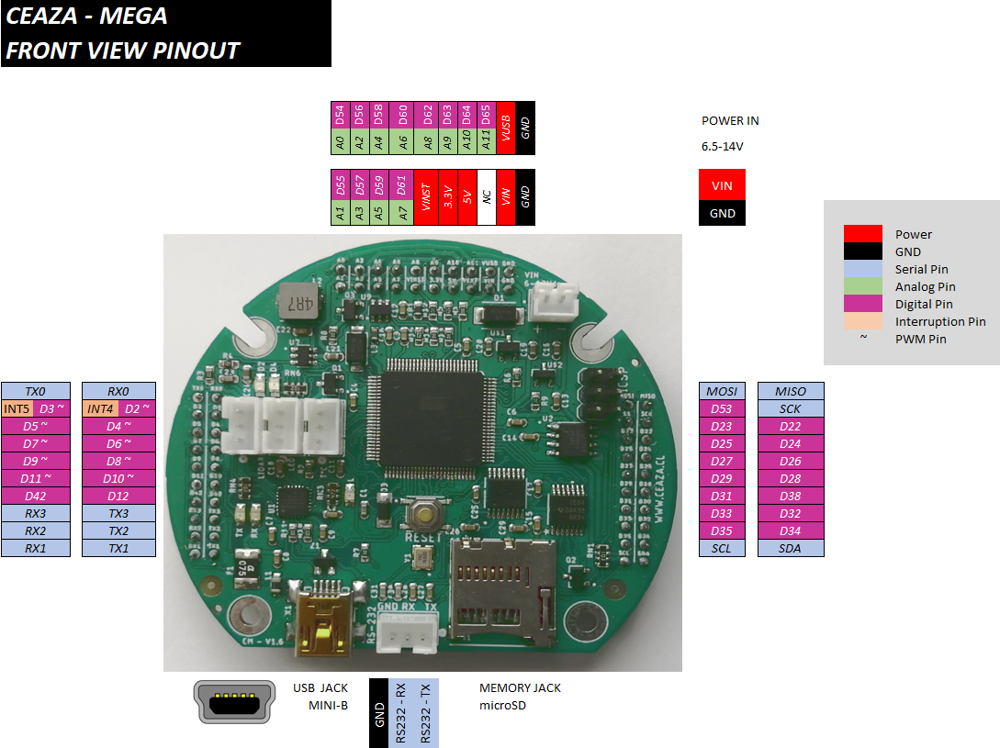

# CEAZA Mega   [![Badge License]][License]

*A reliable & expandable low power data  
logger for scientists, based on the Arduino.*

 
 

 
 

## What It Is

Is a new simple, robust and expandable datalogger Arduino derivative board based in typical maker’s community integrations.  The board was designed and implemented taking into account requirements as low consumption, expandability and integration. Different tests where made so reliability in low temperatures and low energy needs are satisfied. 
Is expected that the scientific community can add this board to their tool set, as this board solves the energy problem and present an easy transition from handmade logger integrations.

CEAZA mega board integrate:
- ATMEGA2560 8-bit microcontroller
- Arduino mega 2560 bootloader for easy Arduino Ide compatibility
- A real time clock (RTC)
- A microSD card socket for data storage
- USB/Serial driver connected to UART0 for program as an Arduino mega or computer serial communication
- Serial RS-232 driver (connected to UART1) 
- Controlled high frequency (2MHz) step down switching regulator MP2451DT-LF-Z configured to deliver 5V and up to 600mA for external sensor
- Built in 10Kohm NTC thermistor for PCB temperature monitoring
- Power source system voltage monitor
- Terminal for direct connection with DS18B20 1-wire digittal temperature sensor
- 3 LEDs on board and external duplicate conection for two of those LEDs
- an ISCP terminal to program with external programer
- 3 expansion terminal for direct wires soldering or easy plug/unplug expansion boards for CEAZA MEGA

 

Furthermore, all integrated devices, except the main **MCU**  
uses a firmware controlled switched power supply in order  
to optimize de power consumption.

## Documentation

A comprehensive documentation for well understand, use  
or modify the **CEAZA MEGA** board is available in our Wiki. 

Additionally we share our schematic  
diagrams and Arduino example codes.

 
 

## Quickstart guide

1.  Connect a `6.5 - 14V` DC power supply.

2.  Connect the **CEAZA MEGA** main board to  
    the host PC with he mini-USB connector.

3.  Open the Arduino IDE.

4.  Select the Arduino Mega board  
    and the corresponding COM port.

5.  Open any of example sketches.

6.  Upload to the board.

 
 

## Contact & Support

For all kinds of inquiries, please contact me to  
my e-mail address: adrian.gallardo@ceaza.cl

 
 

## Contributing

You are welcome to contribute to the development  
or improvement of **CEAZA MEGA** hardware design  
or example application codes.

Feel free to submit a new pull request via **GitHub**.

 
 

## Academic Context

A paper with more details and performed tests was shown in **[DOI]**. 

 
 

## Disclaimer

Use **CEAZA MEGA** board and examples code at your own risk.  
We do not encourage any malicious use of our board.

 

<!----------------------------------------------------------------------------->

[Badge License]: https://img.shields.io/badge/License-MIT-yellow.svg?style=for-the-badge

[DOI]: http://doi.org/10.11591/ijres.v11.i2.pp175-187

[Preview]: Images/CM_PINOUT.PNG
[License]: LICENSE